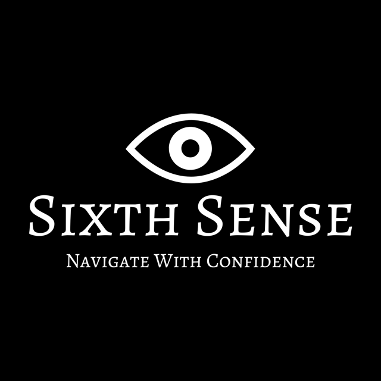
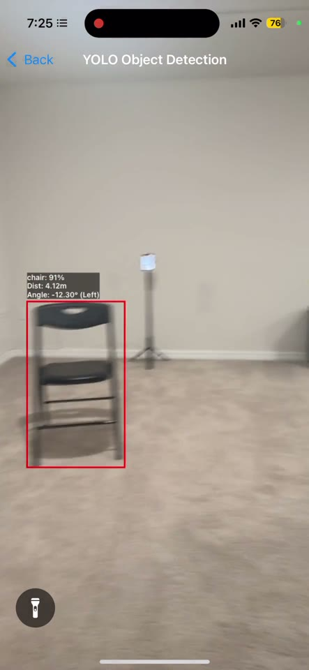
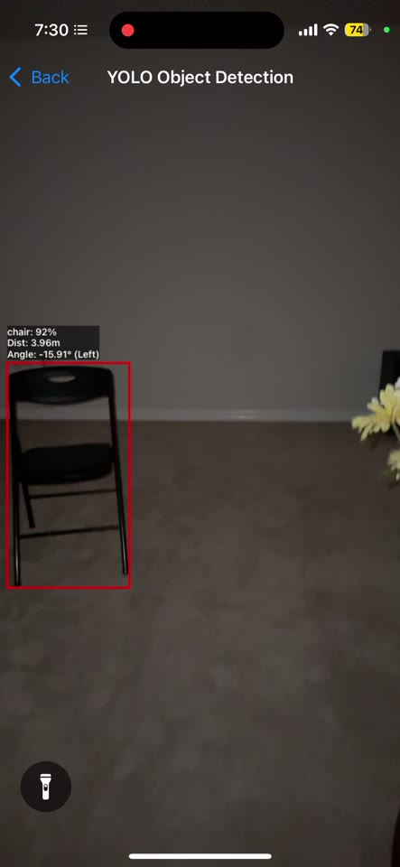
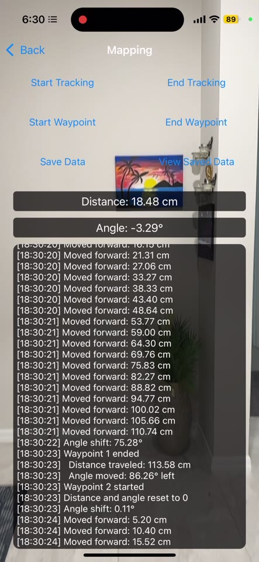
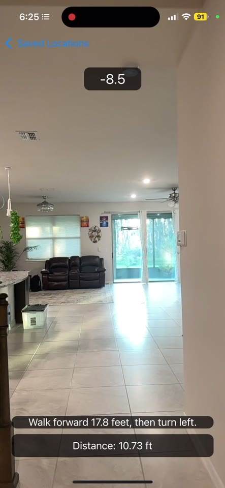

<div align="center">



**An iOS navigation app for blind and low-vision users.**
Indoor route guidance and spoken obstacle alerts, all running on-device.

[](https://www.youtube.com/watch?v=SR_WHzHOZHI)
[](#building)
[](#building)
[](#detection-and-distance)

</div>

---

## What it does

Two features, both built to be used without looking at the screen.

**Route guidance.** Someone sighted walks a route once and the app records it as a series of
waypoints. A blind user can then replay that route and hear turn-by-turn directions like
*"walk forward 17.8 feet, then turn left."* If they over-turn or under-turn, it corrects them.

**Obstacle detection.** The camera runs object detection continuously and announces what's
ahead, how far, and which side: *"chair, 1.9 meters, left."*

<div align="center">

| Detection | Same, lights off | Recording a route | Turn-by-turn |
|:---:|:---:|:---:|:---:|
|  |  |  |  |

</div>

Screenshots are unedited captures from October 2024 on an iPhone 14 Pro. Each detection shows
class, confidence, distance, and bearing (`chair: 91% · 4.12 m · −12.30° Left`). It still works
in a dark room, and the app can turn on the torch. The recording screen's log shows the route
model directly: waypoint ended, distance travelled 113.58 cm, angle moved 86.26° left, next
waypoint, reset to zero.

> These frames are from the October 2024 build, the same one in the demo video, not from the
> source published here. [See below](#where-the-code-stands).

## Demo

[**Watch the 3-minute demo**](https://www.youtube.com/watch?v=SR_WHzHOZHI). It includes
blindfolded walkthroughs of both features: one following a recorded route indoors, one
navigating around real obstacles.

## Performance

| | |
|---|---|
| **15 fps sustained** | 66.7 ms per frame, measured over a 23.3 s window |
| **iPhone 14 Pro, iOS 17.6.1** | the test device |
| **12.73 MB** | Core ML model, 640×640 input |
| **CPU + GPU** | `computeUnits = .cpuAndGPU`, so the Neural Engine is unused |

That 66.7 ms budget covers everything: inference, non-max suppression, distance estimation, and
redrawing the preview with boxes and labels composited on top.

One caveat I want to be upfront about. 15 fps is the app's design cap, not the model's ceiling.
`frameInterval = 2` gates inference to every second frame of a 30 fps capture, so 15 fps is the
most it can do by construction. What the measurement actually shows is that the whole pipeline
fits inside the budget without falling behind, which is a different claim from "the model runs
at 15 fps."

The app has no performance logging in it, so I recovered this number afterward by
frame-differencing a screen recording. That works here because there's no
`AVCaptureVideoPreviewLayer`: the preview image is only ever assigned inside the inference
completion handler, so the screen refreshing *is* an inference finishing. Full method and
reproduction steps in [docs/BENCHMARKS.md](docs/BENCHMARKS.md).

## How it works

### Routes

ARKit's `ARWorldTrackingConfiguration` provides 6-DoF pose. Instead of saving 3D anchors, I
reduce each leg of a route to a distance and a turn:

```swift
struct WavepointSummary: Codable {
    let number: Int      // leg index
    let distance: Float  // cm travelled
    let angle: Float     // degrees turned
}
```

So a route is a dead-reckoning chain. This keeps routes tiny and means replay doesn't need to
relocalize against a saved world map, which is why it works on a fresh session. The cost is that
a route only works from its exact starting position and heading, and error builds up along the
chain with nothing absolute to correct it.

On replay the app tracks distance against the current leg, speaks the instruction through
`AVSpeechSynthesizer`, and compares live yaw against the stored angle to catch bad turns.

### Detection and distance

`yolov8n` runs through `VNCoreMLRequest`. Detections get filtered at 0.5 confidence, then run
through IoU non-max suppression at 0.5.

Distance comes from monocular pinhole geometry, not a depth sensor. For each detection the app
looks up the object's real-world size in a 21-entry table and computes three estimates, from
box width, height, and area:

```
distance_width  = (real_width  × f) / (box_width  × sensor_width)
distance_height = (real_height × f) / (box_height × sensor_height)
distance_area   = (real_area   × f²) / (box_area  × sensor_area)
```

with `f = 4.25 mm` and a 4.80 × 3.60 mm sensor. Averaging three estimates makes it robust to one
bad box dimension, since a partly occluded object with a cut-off width usually still has a
sensible height. The average then goes through a 1-D Kalman filter (`q = 0.1`, `r = 0.1`), which
is what stops spoken distances from jumping around between frames. Bearing comes from the box
centroid against a horizontal FOV derived from the same optics.

Going monocular was a deliberate call. It means no LiDAR requirement, so the app runs on any
iPhone with a camera instead of Pro models only. The tradeoff is accuracy, covered below.

More detail in [docs/ARCHITECTURE.md](docs/ARCHITECTURE.md).

## Building

Needs Xcode 15+, iOS 15.4+, and a real device. ARKit and the camera don't work in the Simulator.

```bash
git clone https://github.com/vishal-naveen/Sixth-Sense.git
cd Sixth-Sense
open SixthSense.xcodeproj
```

Set your own signing team and run. The Core ML model is committed, so there's nothing else to
download.

## Where the code stands

A few things you should know before reading the source.

**This isn't the build in the demo video.** The October 2024 demo shows voice commands
("initialize bedroom to kitchen") and announces objects like backpack and potted plant, neither
of which is in this source's reference table. I no longer have that build's source. What's here
is the February 2025 version, the last copy I have.

**So there's no voice control in this code.** `Info.plist` still declares
`NSSpeechRecognitionUsageDescription` and `NSMicrophoneUsageDescription` left over from the
earlier build, but nothing wires up `SFSpeechRecognizer`. The app talks; it doesn't listen.
Rebuilding that layer is [issue #1](../../issues/1).

**The model is stock.** `yolov8n.mlmodel` is an unmodified Ultralytics export trained on COCO. I
didn't train or fine-tune it. It knows COCO's 80 classes.

## Known limitations

- **Only 21 of the 80 classes report distance.** Anything without a reference-size entry gets
  dropped instead of announced, which silently includes obstacles like `backpack`, `potted
  plant`, `bench`, and `door`. [Issue #3](../../issues/3).
- **Distance gets unreliable with range.** The estimate is driven by apparent object size, so
  error grows with distance and with any object whose real dimensions differ from the table
  value. It's dependable around 1–2 m, which is the range that matters for avoiding something,
  but readings past that should be treated as rough.
- **Optics constants are hard-coded** rather than read from `AVCaptureDevice`, so distances skew
  on other iPhone models. [Issue #4](../../issues/4).
- **No VoiceOver support.** For an app aimed at blind users, this is the one that bothers me
  most: there isn't a single `accessibilityLabel` in the UI. The spoken navigation works because
  the app talks at you, but actually operating the interface needs VoiceOver, which isn't
  supported. [Issue #2](../../issues/2).
- **Route drift.** Dead reckoning accumulates error with no absolute reference, and a route is
  only valid from its exact starting point.
- **`mapping.swift` is dead code.** It's a complete parallel SwiftUI implementation that nothing
  references, and it's arguably the better design since it stores 3D positions instead of
  dead-reckoned legs. It was never wired up. [Issue #5](../../issues/5).
- **No tests.** The distance math, NMS, and the Kalman filter are all pure functions over plain
  values, which makes them the easiest things here to test, and none of them are tested.

## Background

Built between 2023 and 2025 while I was at Middleton High School in Tampa. Third place in the
2024 Congressional App Challenge. I met with the City of Tampa's ADA coordinator about
accessibility requirements, and tested the navigation loop myself blindfolded, which is what
you're seeing in the demo video.

I reorganized and documented this repo in August 2026, so the commit dates reflect the cleanup
rather than when the app was written. The original October 2024 upload is still the first commit
in the history.

## Credits

The project started from Brian Voong's `SmartCameraLBTA` Core ML tutorial project
([Let's Build That App](https://www.letsbuildthatapp.com)); the camera pipeline grew out of that.
Object detection uses [Ultralytics YOLOv8](https://github.com/ultralytics/ultralytics).

## License

My source is [MIT](LICENSE).

The bundled model isn't mine to relicense. `SixthSense/yolov8n.mlmodel` is an Ultralytics
YOLOv8n export and carries AGPL-3.0, per its own metadata, so MIT covers my code only and the
model keeps its own terms. See [NOTICE](NOTICE). Shipping a closed-source app built on these
weights would need a commercial license from Ultralytics.
